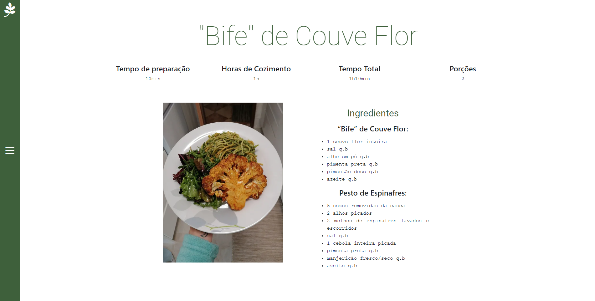

# Marialface

Este projecto é um trabalho em Html, Css e Javascript para a UFCD 9963 do Curso de Técnico Especialista em Tecnologias e Programação de Sistemas de Informação que estou a tirar na ATEC.

É um remake de um site de receitas vegetarianas, originalmente feito em Wix, para Html, Css e Javascript.

    <a href="https://henrique11varela.github.io/Marialface/"> </a>
     
     
    <a href="https://marialface.wixsite.com/cemporcentovegan"> </a>

